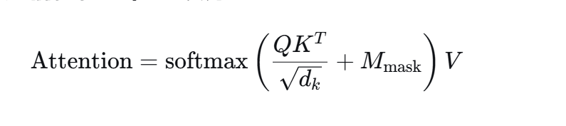

# learn
记录我的学习历程
## Transformer  
### 整体架构图

##编码器：

### 一、输入部分
#### 1、构建独热向量
对于输入部分，首先在预训练阶段会构建一个词表，该词表用来以后对输入的文本的token进行构建独热向量。
比如说一句话：“I love you”，由文本切分器进行一个token的切分，切为“I”，“love”，“you”三个token，对照词表构建一个V维的独热向量，V一般为几万。

#### 2、构建词嵌入向量
每个token的独热向量只有一个维度有数值，其余地方都是0，是无效的，所以要通过一个预训练好的词嵌入矩阵和独热向量相乘，可以降低向量的维度和得到不同语义方面的信息。
通过预训练好的一个词嵌入矩阵和独热向量相乘，将独热向量的维度降为d（512）维，表示512个不同语义方面的信息，这512维的信息可以在一个特定的坐标轴上找到该token的唯一位置。

#### 3、位置编码
根据token在在序列中的位置pos，不同维度i，向量总的维度d和正余弦公式，得到位置编码向量。

将位置编码向量和词嵌入向量逐向量相加，得到的矩阵既有原来词顺序，又有多方的语义信息。
###二、注意力计算
#### 4、将嵌入矩阵和权重矩阵相乘得到Q、K、V
将得到的矩阵和权重矩阵相乘，得到的矩阵既有原来词顺序，又有多方的语义信息。
根据注意力计算公式，得到注意力权重矩阵。
#### 5、计算注意力权重矩阵
第一步：计算Q、K、V
第二步：计算Q和K的点积，得到注意力分数矩阵。
第三步：将注意力分数矩阵除以d的平方根，防止点积结果过大，让数值落在 softmax 最灵敏的区域。
作用：
1、最大的值和第二大的值能拉开适度差距（不会太挤，也不会太极端）
2、梯度最大，学习最快
第四步：对注意力权重矩阵进行 softmax 操作，得到注意力权重矩阵。
第五步：将注意力权重矩阵和V相乘，得到注意力输出矩阵。
#### 6、计算多头注意力
1、将Q、K、V矩阵进行分头，得到多个子矩阵。（一般是8个）
2、对每个子矩阵进行计算注意力权重矩阵。
3、将多个子矩阵进行拼接（concat过程），得到多头注意力输出矩阵。
4、最终线性变换（乘以 W^O）

这一步的作用是融合多头信息，让不同头学到的不同特征相互交互。
#### 7、掩码自注意力（填充法）（用于编码器和解码器）
在实际训练中，一个 batch 里的句子长度不一样：
1、如果句子长度不同，需要对句子进行填充，使句子句子长度相同。（为了在训练时，每个子的长度都相同，方便计算）
例如：

句子1: "我 爱 吃 苹 果"        → 长度 5

句子2: "你 好"                → 长度 2

句子3: "今 天 天 气 真 好"    → 长度 6

2、填充后的句子，需要对填充后的句子进行掩码，使模型只关注有效信息。（为了在计算注意力时，只关注有效信息）

第一步：生成掩码矩阵
假设序列长度是 4（实际有效词 + 填充位），有效词位置为 1，填充位为 0：

第二步：扩展成注意力分数矩阵（4×4）
掩码矩阵会扩展成：
        Key1  Key2  Key3  Key4
Query1 [  1,    1,    0,    0 ]

Query2 [  1,    1,    0,    0 ]

Query3 [  0,    0,    0,    0 ]  
← Query3 是 PAD，但也掩掉

Query4 [  0,    0,    0,    0 ]
注意：Key3、Key4 是 PAD，所以所有 Query 都不能关注它们（列掩掉）。
同时 Query3、Query4 本身是 PAD，它们的行通常也全掩掉（因为不需要计算 PAD 位置的输出）。

第三步：在 softmax 之前把掩码位置设为 -∞

其中 M_mask 中：
有效位置：填 0（不影响 softmax）
填充位置：填 -∞（负无穷）

注意力分数矩阵（缩放后）+ 掩码:
        
        Key1   Key2   Key3   Key4
Query1 [ 2.3,   1.5,  -∞,   -∞ ]

Query2 [ 0.8,   2.1,  -∞,   -∞ ]

Query3 [ -∞,   -∞,   -∞,   -∞ ]  

← 整行无效

Query4 [ -∞,   -∞,   -∞,   -∞ ]

↓ softmax 后 ↓

        Key1   Key2   Key3   Key4
Query1 [ 0.69,  0.31,  0,     0 ]

Query2 [ 0.21,  0.79,  0,     0 ]

Query3 [ 0   ,  0   ,  0, 0     ] 
← 虽然有值，但后续会忽略

Query4 [ 0  ,  0   ,  0   , 0   ]

第五步：将掩码多头注意力权重矩阵和V相乘，得最终线性变换到多头注意力输出矩阵。
#### 8、残差连接
将多头注意力输出矩阵进行层归一化，得到层归一化后的矩阵。
#### 9、层归一化
将层归一化后的矩阵和输入矩阵进行残差连接，得到残差连接后的矩阵。
###三、前馈网络

